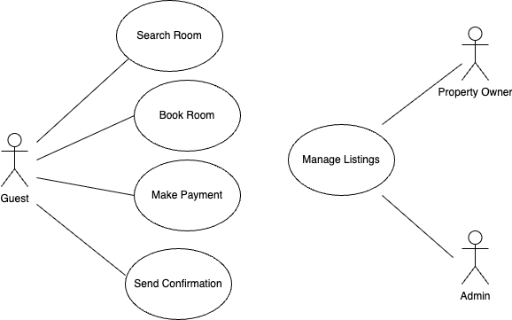

# Requirement-analysis in Software Development
## Introduction

This repository contains a comprehensive walkthrough of the Requirement Analysis phase within the Software Development Life Cycle (SDLC). It is part of a hands-on project designed to simulate a real-world development scenario: building a Booking Management System.

The goal is to define clear, structured, and detailed requirements — both functional and non-functional — and to visualize user interactions and system behavior. This repository serves as the foundation for planning, development, and eventual implementation of the system, ensuring alignment with business and user needs.
## What is Requirement Analysis?

Requirement Analysis is a crucial phase in the Software Development Life Cycle (SDLC) that involves identifying, gathering, documenting, and analyzing the needs and expectations of stakeholders for a software system. 

Its primary goal is to ensure that the development team and the client have a shared understanding of what the system should do, how it should behave, and any constraints it must operate within.

By thoroughly analyzing requirements early, teams can reduce misunderstandings, scope creep, and costly rework later in the project. It sets the foundation for design, implementation, testing, and deployment.
## Why is Requirement Analysis Important?

Requirement Analysis plays a vital role in ensuring the success of any software project. Here are three key reasons why it is critical in the Software Development Life Cycle (SDLC):

### 1. Clarity and Shared Understanding
It ensures that all stakeholders — from clients to developers — have a unified understanding of what the system should accomplish. This reduces ambiguity and minimizes the risk of misinterpretation.

### 2. Cost and Time Efficiency
By identifying requirements early, teams can prevent costly changes during later stages of development. A clear roadmap reduces unnecessary rework, saves time, and helps avoid budget overruns.

### 3.  Foundation for Testing and Validation
Defined requirements become the basis for creating test cases and acceptance criteria. This allows teams to validate whether the software meets user expectations and business goals before release.
## Key Activities in Requirement Analysis

The requirement analysis phase involves several structured activities to ensure all system needs are clearly defined, understood, and agreed upon. Here are the five key activities:

- **Requirement Gathering**  
  This is the initial step where information is collected from stakeholders, users, and business documents to understand the high-level needs and objectives of the system.

- **Requirement Elicitation**  
  This involves actively engaging stakeholders through techniques such as interviews, surveys, brainstorming sessions, or workshops to uncover detailed functional and non-functional requirements.

- **Requirement Documentation**  
  All gathered and elicited requirements are recorded in a structured format (e.g., Software Requirement Specification - SRS) to ensure clarity, traceability, and agreement across the team.

- **Requirement Analysis and Modeling**  
  Requirements are reviewed for completeness, feasibility, and consistency. This step often includes modeling tools such as use case diagrams or flowcharts to visualize how users will interact with the system.

- **Requirement Validation**  
  Finally, the documented requirements are validated with stakeholders to confirm accuracy and alignment with business goals. This helps catch errors early and avoids scope creep.
##  Types of Requirements

In software engineering, requirements are typically classified into two main categories: **Functional Requirements** and **Non-functional Requirements**. Both are essential to building a complete and effective system.

---

### Functional Requirements

Functional requirements define **what the system should do**. These are specific features, actions, or operations that the system must support.

**Examples (Based on Hotel Booking App):**
- Users should be able to **search for available rooms** by location, date, and price range.
- Users should be able to **create and manage bookings**.
- Admins should be able to **add, edit, or remove hotel listings**.
- The system should **process payments securely** using integrated payment gateways.
- Guests should receive **email or SMS confirmation** after booking.

---

### Non-functional Requirements

Non-functional requirements define **how the system should behave**. They focus on system performance, usability, reliability, and other quality attributes.

**Examples (Based on Hotel Booking App):**
- The system should load search results **within 2 seconds** for 95% of queries.
- The application must be **accessible on both desktop and mobile devices**.
- User data must be **encrypted** during storage and transmission.
- The system should support up to **10,000 concurrent users** without performance degradation.
- The booking service should have **99.9% uptime** per month.

---

Understanding both types ensures that the system not only works as intended but also performs reliably and securely under real-world conditions.

## Use Case Diagrams

A Use Case Diagram is a visual representation of the interactions between system users (called *actors*) and the functionalities (*use cases*) the system provides. It helps stakeholders quickly understand what the system is supposed to do, and how users will interact with it.

### 💡 Benefits of Use Case Diagrams:
- Simplifies communication between developers and stakeholders
- Clarifies system scope and functionalities
- Identifies different user roles and their interactions with the system

Below is a basic use case diagram for the Booking Management System.

## Acceptance Criteria

Acceptance Criteria are a set of predefined requirements that a software feature must meet in order to be considered complete and acceptable by stakeholders. They are written in clear, testable language and guide both development and testing teams.

###  Why Acceptance Criteria Matter:
- They align expectations between developers, stakeholders, and users.
- They help avoid misunderstandings or incomplete feature delivery.
- They serve as the basis for writing test cases and validating functionality.
- They ensure that features fulfill both functional and non-functional requirements.

---

###  Example: Acceptance Criteria for “Checkout” Feature

**Feature:** Checkout (Booking Finalization)

**Acceptance Criteria:**
- The user must be able to review booking details before final confirmation.
-  The system should display the total cost, including taxes and service fees.
-  The user must select a payment method (credit card, PayPal, etc.).
-  Upon successful payment, a confirmation page is shown with a booking reference.
-  A confirmation email is sent automatically within 1 minute after booking.
-  If payment fails, the user is notified and prompted to try again.

Each criterion above is specific, measurable, and testable — ensuring the “Checkout” feature behaves exactly as intended.
